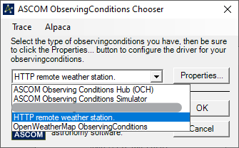

# ASCOM.HTTPObservingConditions

A remote weather station plugin for ASCOM

## How does it work?

This plugin performs an HTTP request to your weather station server and
retrieves a JSON object representing the last measurement.

The response is then deserialized into a WeatherData object and exposed to
ASCOM through properties.

To check what fields are implemented, take a look at *WeatherData.cs* class.

Your JSON response must include a field with the time of the last measurement
because the driver requires it.

## Install

Check out the release section of the repository and download the latest version
installer. Open ASCOM preferences pane and setup the driver with the URL of your
weather station data.

N.B. the URL must start with either http:// or https://, invalid URLs are silently
rejected and a fallback **http://localhost/weather/json** endpoint will be used.

You can check for errors using the *trace log* function.

## Trace logging

A trace log of the driver activities is generated whenever the driver is run.
You can find under Documents > ASCOM > Logs *current date* as a bunch of text files.

To disable the trace logging, untick the option in the driver preferences.

## Configuring

Open your ASCOM application and select Preferences for the ObservingConditions driver.

You should have a chooser window like this:

Now click on the dropdown menu and select *HTTP remote weather station*.
Click on Properties and enter a server URL where the driver will take its measures
from.

The URL MUST begin with either "http://" or "https://".

N.B. You will need to be able to reach the server throughout the entire session (from connection
until disconnection), otherwise measures won't be updated.

If the server can be reached, it will be added to your recent server list. Right now you can't
edit the list from this windows, but you can from ASCOM Profile Explorer.

If you open Preferences once again, it will display your recent servers:

